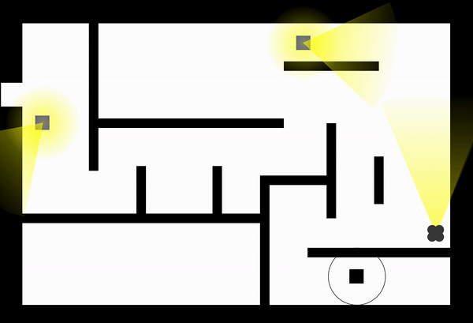
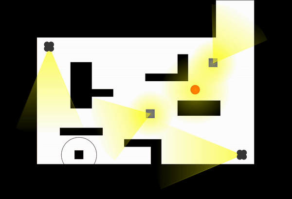
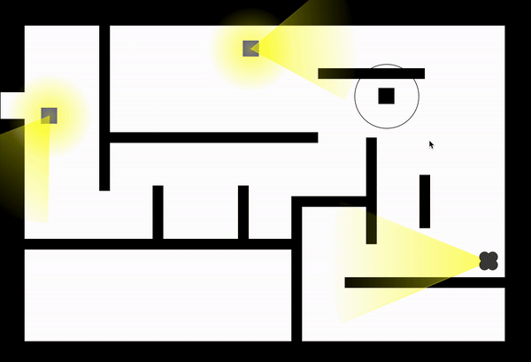

<p align="center"></p>


&nbsp;&nbsp;&nbsp;&nbsp;&nbsp;&nbsp;&nbsp;&nbsp;&nbsp;&nbsp;&nbsp;&nbsp;&nbsp;&nbsp;&nbsp;&nbsp;&nbsp;&nbsp;&nbsp;&nbsp;
&nbsp;&nbsp;&nbsp;&nbsp;&nbsp;&nbsp;&nbsp;&nbsp;&nbsp;&nbsp;&nbsp;&nbsp;&nbsp;&nbsp;&nbsp;&nbsp;&nbsp;&nbsp;&nbsp;&nbsp;
&nbsp;&nbsp;&nbsp;&nbsp;
[![Language][kotlin-shield]][kotlin-url]
[![Language][jason-shield]][jason-url]
[![MIT License][license-shield]][license-url]
[![Conventional Commits][conventional-commits-shield]][conventional-commits-url]

## Overview

Project for Intelligent Systems Engineering course a.y. 2023-2024.

*Agent Seek* is a simple game where the player moves in a 2D environment, seeking the exit that
leads to the next level. The player needs to avoid the agents that are trying to catch him.



There are three types of agents:

- **Camera Agent** (the one in gray): it can turn around seeking for the player, but it can't move. When the player
  enters its field of view, it will alert the other agents.
- **Hearing Agent** (the one in red): it can move in the environment, but can't see the player. It can only hear the
  player producing noise, and start chasing the source of noise.
- **Guard Agent** (the one in blue): it can move in the environment and see/hear the player. It will chase the player as
  soon
  as it sees/hears him, and will alert the other guard agents to go protect the exit. Also, it receives the alert from
  the camera agent.



The player can move using WASD commands. Holding down the SHIFT key will make it move slower, but more silently. Lastly,
the player can click around the screen, provided that the clicked point isn't too far from the player, to produce noise
in that point. This way, he/she can attract the agents and exploit the situation to reach the exit.



## Installation

To run the game, simply download the JAR from the latest release and run it with the following command:

```shell
java -jar agentseek-<VERSION>.jar
```

<!--
***
    GITHUB SHIELDS VARIABLES
***
-->

[kotlin-shield]: https://img.shields.io/badge/Kotlin-7F52FF?style=flat&logo=Kotlin&logoColor=white

[kotlin-url]: https://kotlinlang.org/

[jason-shield]: https://img.shields.io/badge/Jason-AFAFAF

[jason-url]: https://jason-lang.github.io/

[license-shield]: https://img.shields.io/github/license/FreshMag/AgentSeek.svg?style=flat

[license-url]: https://github.com/FreshMag/AgentSeek/blob/master/LICENSE

[conventional-commits-shield]: https://img.shields.io/badge/Conventional%20Commits-1.0.0-%23FE5196?logo=conventionalcommits

[conventional-commits-url]: https://conventionalcommits.org
